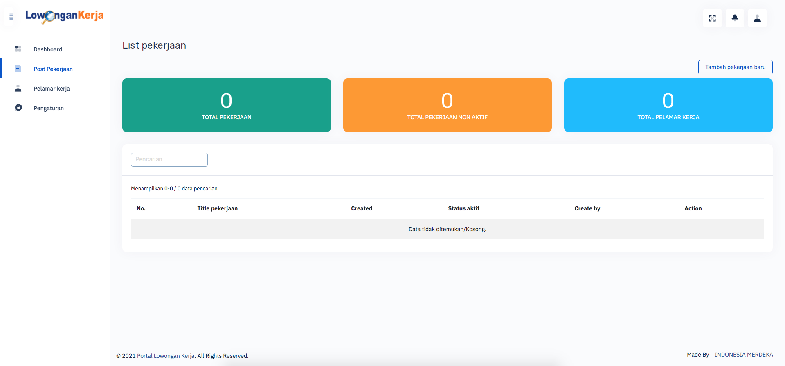
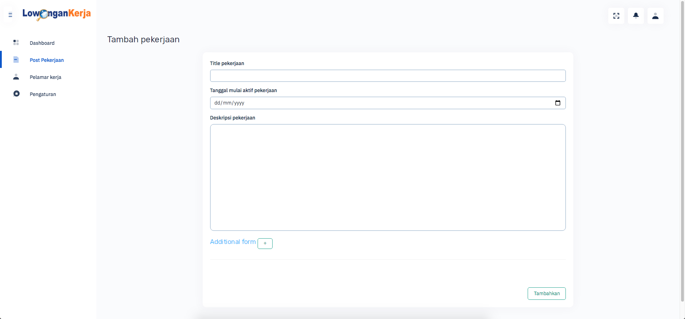
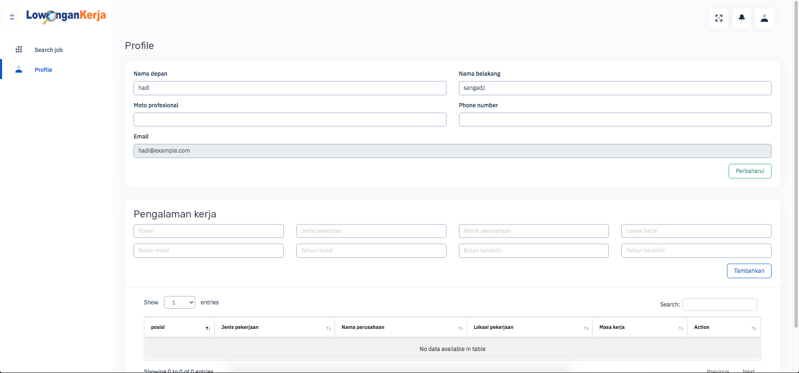
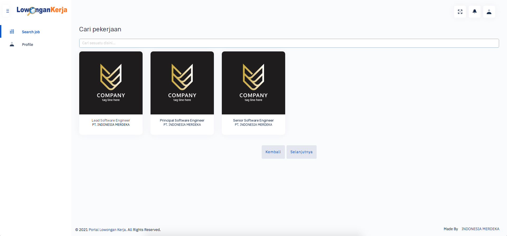

# APPLICANT CV TEST CODE

Test code membuat application applicant CV Menggunakan Framework AdoniJs dari NodeJs

## PREVIEW LAYOUT
- LOGIN PAGE  
  
- REGISTER PAGE  
  
- LIST JOB REGISTER PAGE  
  
- FORM ADD NEW JOB PAGE  
  
- APPLICANT INFORMATION PAGE  
  
- SEARCH JOBS PAGE  
  

FLOW APLIKASI
1. User dengan type company akan mendaftarkan postingan pekerjaan dengan form dynamic field.
2. User dengan type applicant akan memasukkan informasi diri dan pengalaman kerja nya.
3. User applicant akan submit ke pekerjaan yang telah di posting oleh user company pada halaman search job (submit job belum ada)
4. User company akan melihat pelamar pekerja yang telah submit ke postingan pekerjaan nya. (belum ada)
5. User applicant akan mengetahui update mengenai informasi nya seperti (Lamaran dikirim, Lamaran sudah dilihat, Lamaran sudah dilihat) (belum ada)
